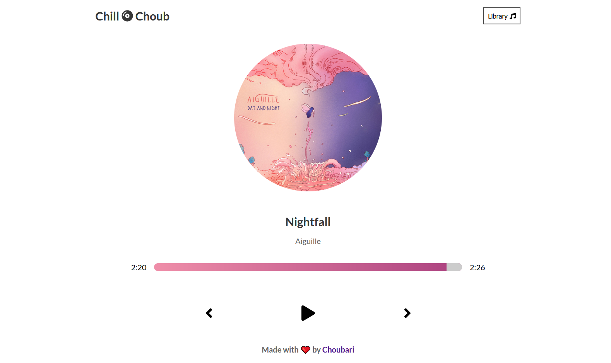
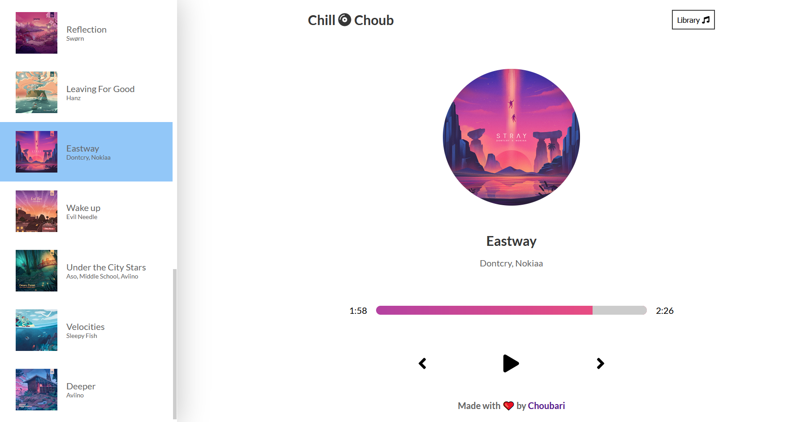

<h1 align="center">Chill 💿 Choub</h1>

🵠Your favorite LoFi Music PlayerğŸ§

⭐⭐⭐⭐⭐</a>

 

- A Responsive Web-App to enjoy and chill Lofi Beats.
- Developed using ReactJS.
- Beautiful styling using SASS.
- Music Collected manually from [ChillHop](https://chillhop.com/) and stored in [playlist.js](/src/playlist.js).
- Deployed on Vercel.
- [Live DEMO](https://chill-choub.vercel.app/)

## Screenshots :

 

  
  

---

